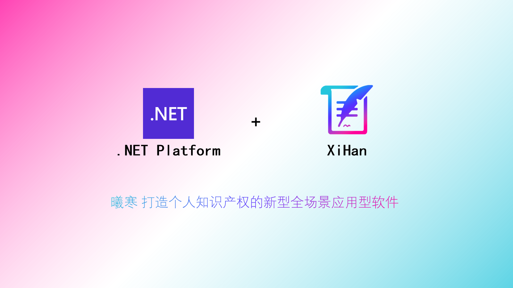

# ZhaiFanhuaBlog.Framework

        

[贡献代码](CONTRIBUTING.md)

[更新沿程](UPDATETIMELINE.md)

This is the back end of the ZhaiFanhuaBlog application, which is based on DotNet6.

用到的技术、框架或工具：

.NET6

AutoMapper

SqlSugar

JWT

Log4Net

Swagger

