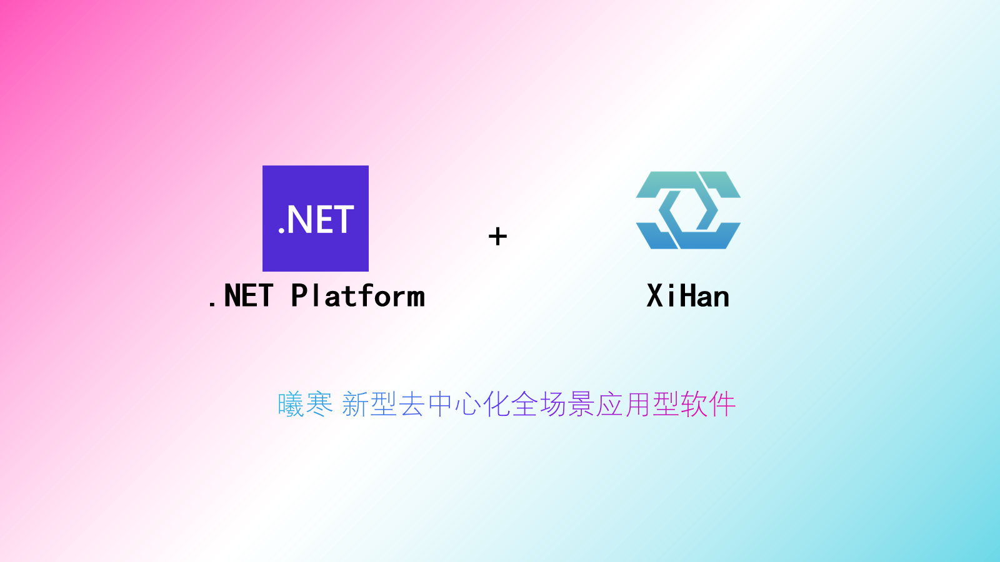

 

        

基于DotNet7的打造个人知识产权的新型全场景应用型软件项目。

### 高效快速 返哺开源 用心创作 探索未知


## 快速开始

官方文档：[曦寒官方文档](https://docs.xihan.fun)

在线体验：[曦寒接口文档（后端仅只）](https://api.xihan.fun)


## 所用框架

- DotNet7(CSharp)；
- WebApi；

### 框架模块

- [x] 采用`仓储+服务+接口`的形式封装框架；

- [x] 全面异步 async/await 开发；

- [x] DDD领域驱动思想开发；

- [x] 国产数据库 ORM 组件 SqlSugar，使用 CodeFirst 开发模式，支持自由切换多种数据库，MySql/SqlServer/Sqlite/Oracle/Postgresql/达梦/人大金仓；

- [x] 项目启动，支持自动生成种子数据；

- [x] 三种日志记录，异常/请求响应操作/登录等；

- [x] 搭配全套前端项目：

  - 后端：XiHan.Framework；

  - 前端：XiHan.Display；

  - 文档：XiHan.Docs；

- [x] 统一集成授权鉴权；

### 组件模块

- [x] 支持App全局静态模块；

> 封装大量全局对象，任何地方可调用；

- [x] 支持全局日志管理器；


> 使用强大、灵活、高性能的 `Serilog.AspNetCore` 作为日志组件；
>
> 支持异步写入，支持注入，支持全局，支持业务分类；

- [x] 支持全局配置管理器；

> 使用官方灵活的 `Microsoft.Extensions.Configuration` 配置库；
>
> 支持绑定配置类链式读取配置；

- [x] 支持全局服务管理器；

> 使用官方高性能轻量级的 `Microsoft.Extensions.DependencyInjection` 依赖注入容器；
>
> 支持批量注入服务（自定义生命周期）、属性和字段注入（类似 Java 的 Autowired）；

- [x] 支持全局请求管理器；

> 使用 `Microsoft.AspNetCore.Http` 核心库处理HTTP请求和响应；
>
> 支持动态获取当前 HttpContext 对象；

- [x] 支持系统、环境、应用监控；
- [x] 支持参数验证、规范相应、分页组件；
- [x] 提供 Redis 做缓存处理，默认开启内存缓存；
- [x] 使用 Swagger 做API文档；
- [x] 使用 MiniProfiler 做接口性能分析 ；
- [x] 使用 Mapster 处理对象映射；
- [x] 支持 CORS 跨域；
- [x] 封装 JWT 自定义策略授权；
- [x] 使用 SignalR 双工即时通讯；
- [x] 添加 RateLimiting 做 API 限流；
- [x] 使用 Quartz.Net 做任务调度；
- [x] 支持健康检查；
- [ ] 支持 数据库`读写分离`和多库操作；
- [x] 支持邮件通知、群机器人通知（钉钉、飞书、企业微信）和自定义Webhook通知；
- [x] 支持文件导入导出、下载模板文件；
- [ ] 支持QQ、微信、支付宝、Github、Gitlab、Gitee三方登录；
- [ ] 新增 Redis 消息队列；
- [ ] 新增 RabbitMQ 消息队列；
- [ ] 新增 EventBus 事件总线；
- [ ] 新增 ES 搜索配置；

### 微服务模块

- [x] 可配合 Docker 实现容器化；
- [x] 可配合 Nginx 实现负载均衡；
- [ ] 可配合 Ids4 实现认证中心；


## 开发计划（插件形式）

### 基础功能模块

- [x] 数据字典；
- [ ] 通知公告；
- [ ] 用户管理；
- [ ] 角色管理；
- [ ] 权限管理；
- [ ] 菜单管理；
- [ ] 文件存储；
- [x] 后台任务管理；
- [x] 系统日志管理；
- [x] 系统监控；

### 博文模块

- [ ] 文章管理（带加密）、分类（带加密）、标签、历史版本、收藏、统计；
- [ ] 开源创作（类似git功能）、评论、点赞；
- [ ] 无障碍阅读；
- [ ] 无感导入导出其他平台文章；

### 相册模块

- [ ] 照片管理；
- [ ] 照片信息获取；
- [ ] 照片轨迹；

### 音乐模块

- [ ] 音乐管理；
- [ ] 热歌推荐；

### 视频模块

- [ ] 离线下载授权平台视频；
- [ ] 视频分类；
- [ ] 视频弹幕；

### 聊天模块

- [ ] 在线聊天；

### 寻他模块

- [ ] 友链申请、状态检测；

- [ ] 公共友链世界、内容共享、流量共享；


### 开源模块

- [ ] 开源代码的项目管理；

### 卡密模块

- [ ] 为开源项目的捐赠版或其他资源自动分发授权；
- [ ] 支付功能；

### 广告模块

- [ ] 广告管理；
- [ ] 推送规则；

### 智能互联模块

- [ ] 智能家居互联、控制；
- [ ] DIY互联；

## 启动

```
dotnet /yourpath/XiHan.WebApi.dll --environment=Production --urls=http://*:9708 --ip=127.0.0.1
```

## 项目相关

贡献代码：[贡献代码](CONTRIBUTING.md)

更新沿程：[更新沿程](CHANGELOG.md)

## Status


